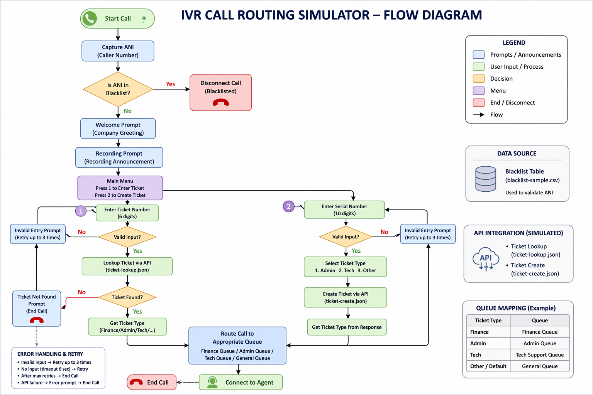

# IVR Call Routing Simulator

Enterprise-grade IVR simulation inspired by Genesys Cloud Architect

This project demonstrates real-world call routing, retry handling, API integration, and customer experience logic used in modern contact centers.

---

## Why This Project Matters
Modern contact centers rely on IVR systems to automate customer interactions and optimize agent workload.  
This project demonstrates how real-world routing logic, validation, and API integrations are implemented.

---

## Features

### 1. ANI Blacklist Check
- Incoming caller number (ANI) is validated against a data table  
- If number is blacklisted → Call is disconnected immediately  

---

### 2. Welcome & Compliance Prompts
- Premium welcome prompt  
- Call recording disclaimer  

---

### 3. Ticket Lookup Flow
- User enters 6-digit ticket number  
- Input validation (exactly 6 digits)  
- Timeout handling (6 seconds)  
- Retry logic (3 attempts)  

#### API Integration
- Fetch ticket metadata:
  - Ticket ID  
  - Description  
  - Serial Number  
  - Ticket Type  

#### Routing Logic
- Finance → Finance Queue  
- Administration → Admin Queue  
- Sales → Sales Queue  

---

### 4. Ticket Creation Flow
- User presses 1 to create ticket  
- Collect 10-digit serial number  
- Retry logic (3 attempts)  

#### Ticket Type Selection
- Press 1 → Admin  
- Press 2 → Tech Support  

#### API Integration
- Create ticket using backend API (Salesforce simulation)  
- Retrieve ticket metadata  

#### Routing
- Dynamic routing based on ticket type  

---

## Tech Stack
- IVR Design (Genesys Cloud concepts)  
- REST APIs  
- Data Tables  
- Call Routing Logic  
- Error Handling & Retry Mechanism  

---

## Project Structure

```
ivr-call-routing-simulator/
│
├── call-flows/
│   ├── main-flow.md
│   ├── ticket-lookup-flow.md
│   ├── ticket-creation-flow.md
│
├── api/
│   ├── ticket-lookup.json
│   ├── ticket-create.json
│
├── data/
│   ├── blacklist-sample.csv
```

---

## How to Run
1. Make sure Python is installed (3.x)  
2. Run the IVR simulator:

```bash
python app/main.py
```

3. Follow prompts in terminal  

---

## Sample Terminal Output

### Ticket Lookup Flow

```
Enter ANI (caller number):
> 9876543210

Welcome to Varun.com
Calls may be recorded for quality and training.

Enter ticket (6 digits) or press 1 to create:
> 2

Enter 6-digit ticket:
> 123

Invalid input. Try again.
Enter 6-digit ticket:
> 123456

Routing to Finance Queue
```

---

### Ticket Creation Flow

```
Enter ANI (caller number):
> 9876543210

Welcome to Varun.com
Calls may be recorded for quality and training.

Enter ticket (6 digits) or press 1 to create:
> 1

Enter 10-digit serial:
> 12345

Invalid input. Try again.
Enter 10-digit serial:
> 9876543210

Press 1 Admin, 2 Tech:
> 2

Ticket created. Routing to Tech Support Queue
```

---

### Blacklisted ANI

```
Enter ANI (caller number):
> +919999999999

Call disconnected (blacklisted).
```

---

## IVR Flow Diagram


---

## Key Highlights
- Simulates enterprise-grade IVR system  
- Implements retry + timeout handling  
- Demonstrates backend API integration  
- Designed for scalability and reliability  

---

## Future Enhancements
- NLU integration (Dialogflow)  
- Multi-language support  
- Real-time analytics dashboard  

---

## Author
Varun Pandey  
Senior Software Engineer | Contact Center & IVR Specialist  